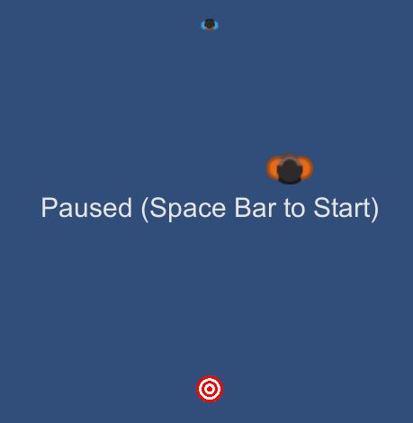

# DodgeTheGuards
A case study for the Gameheads programming class.  

## Introduction

This is a programming exercise where you will create a simple movement behavior for a non-player-character in a tiny sample game. 

The game has three types of characters: one Hunter, one Quarry, and several Guards. You will be creating the AI logic for the Hunter.  The Hunter's job is simple: reach the Quarry without being intercepted by the guards.  Note that the Hunter is faster than the Guards, but the Guards might be numerous, and advantageously positioned.  

## Launching the Unity Project 

This project uses Unity 2018.4.22f1.  

When you run the SampleScene, you will see three sprites: The blue Hunter, the orange Guard and the Quarry, which looks like a bullseye.  



Press the spacebar to see the Hunter run towards the Quarry, and probably get stopped by the Guard.  

### Choosing a different strategy 

The GUI at the bottom of the screen lets you choose between different strategies for seeking the target.  


You can restart the scenario with any number of guards.  


Try the different strategies with different number of guards.  

### Keyboard and Mouse Controls 

1. Hold down the **left mouse** button to have the Quarry chase the mouse cursor.  You can see how the Hunter performs when chasing a moving target. 

2. **Right-click** to drop new guards. You can test a strategy against different Guard formations.

3. Hit the **space bar** to pause the game, or to restart game that is finished. 

## Creating Your Own Strategy 

To create a new strategy, *you do not need to edit any existing files*.  

Create a new `.cs` file with a new subclass of `SeekingStrategy`, like this: 

```C# 
public class MyVeryOwnSeekingStrategy: SeekingStrategy 
{
    public override Vector2 ChooseWaypoint(ICharacter seeker, ICharacter target, IEnumerable<ICharacter> guards)
    {
        Vector2 result; 

        // Write your own code here to calculate a position for the seeker to run towards. 
        // This function will get called every frame.  

        return result; 
    }
}
``` 

Look at `SeekingStrategies.cs` for ideas about what to do.  

Your strategy will automatically appear on the selection GUI: 


You can have mulitple strategies, as long as you name the classes differently, and each one will show up in the menu.  

## The Assignment

Try to come up with a good strategy for seeking the quarry. Try it out against different Guard formations, and try having it chase a moving target.  

### Discussion Questions

1. What makes a good strategy? What else is important besides reaching the target? 

2. How does the game design affect the criteria for a good strategy? Can you think of different kinds of games that would need different strategies?  


Credits: 
- Created by Marc LeBlanc using Unity. 
- Character sprites from Sports Pack by Kenney Vleugels (Kenney.nl)


